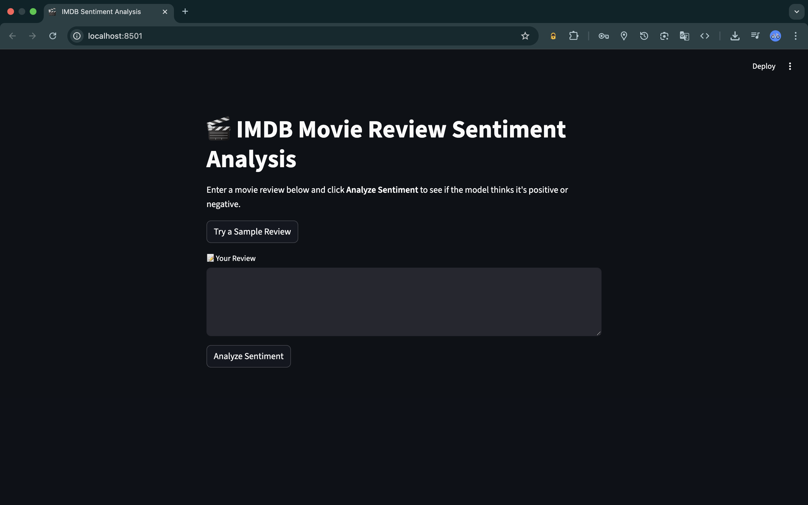
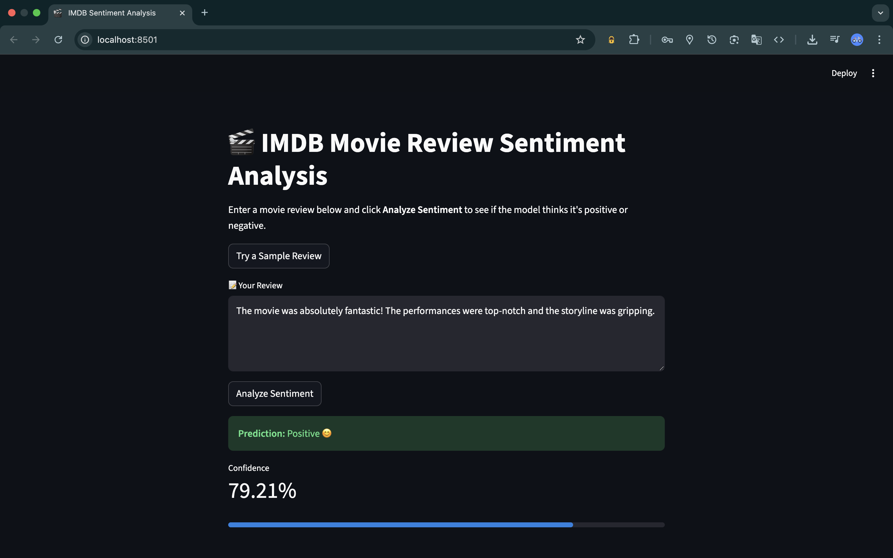
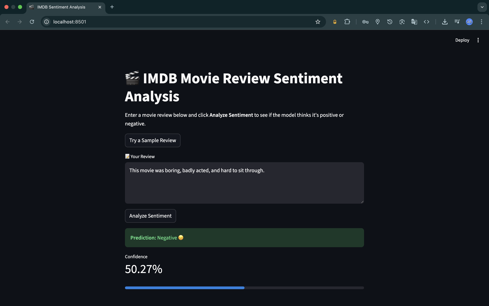

# 🎬 IMDB Movie Review Sentiment Analysis

This project analyzes the sentiment (Positive or Negative) of IMDB movie reviews using a Recurrent Neural Network (RNN) built with TensorFlow/Keras. It features a user-friendly Streamlit web app for real-time inference, and includes the full training code and pre-trained model.

---

## 🚀 Features

-  Predicts sentiment (Positive 😊 or Negative 😞) from user-written or sample reviews  
-  Built with a trained RNN model using Keras  
-  Streamlit-based interactive UI  
-  Includes full training notebook 
-  Uses IMDB dataset with word-level tokenization  

---

## 🧠 Model Overview

- **Architecture**: Embedding → LSTM → Dense  
- **Training Data**: IMDB movie reviews (`keras.datasets.imdb`)  
- **Vocabulary Size**: 10,000  
- **Sequence Length**: 500 tokens  
- **Loss Function**: Binary Crossentropy  
- **Optimizer**: Adam  

---

## 📁 Project Structure

- `images` → Output of the project  
- `app.py` → Main application script  
- `imdb_word_index.json` → Datasets of words  
- `model.keras` → Trained Keras model file  
- `notebook.ipynb` → Collab notebook for exploration, training & analysis  
- `LICENSE` → Project license  

---

## 🖼️ Demo

###  Home Page


###  Analysis Output 1


###  Analysis Output 2


---

## ⚙️ Installation & Setup
1. Clone the repo:
   ```bash
  git clone https://github.com/adars-h-agrawal/imdb_sentiment_analysis_rnn.git
  cd imdb_sentiment_analysis_rnn

2. Run the Streamlit app:
   ```bash
   streamlit run app.py

---

**Author**: Adarsh Agrawal

---

## 📜 License

This project is licensed under the MIT License — see the [LICENSE](LICENSE) file for details.

